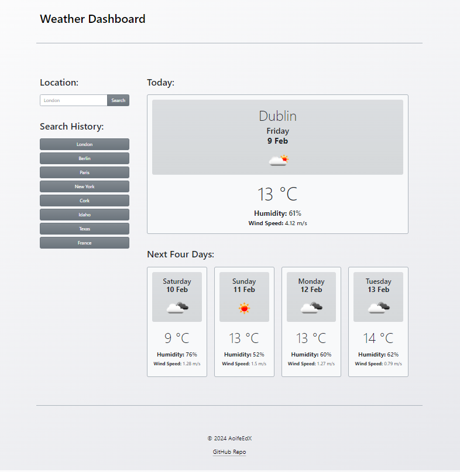

# Weather Dashboard

## Your Task

A simple weather dashboard webpage that features dynamically updated HTML and CSS. It uses the [5 Day Weather Forecast](https://openweathermap.org/forecast5) to retrieve weather data for cities, and presents a five day weather forecast.

## Links

* [Deployed website](https://aoifeedx.github.io/weather-dashboard/)
* [GitHub repository](https://github.com/AoifeEdX/weather-dashboard)

### Features:
* When a user searches for a city they are presented with current and future conditions for that city and that city is added to the search history
* When a user views the current weather conditions for that city they are presented with:
   * The city name
   * The date
   * An icon representation of weather conditions
   * The temperature
   * The humidity
   * The wind speed
* When a user views future weather conditions for that city they are presented with a 5-day forecast that displays:
   * The date
   * An icon representation of weather conditions
  * The temperature
  * The humidity
* When a user clicks on a city in the search history, they are again presented with current and future conditions for that city

## Screenshot

## Credits

Instructions and starter code provided by edX (Skills Boot Camp in Front-End Web Development). 

### Resources

The following sites were used for reference:

* Guide on JavaScript elements from [Learn X in Y minutes](https://learnxinyminutes.com/docs/javascript/).
* Guides on working with dates and time from [Day.js](https://day.js.org/docs/en/display/format).
* Guide on showing JavaScript data in HTML from [JavaScript Tutorial](https://www.javascripttutorial.net/javascript-dom/javascript-textcontent/).
* Guide on using JQUERY from [JQUERY User Interface](https://jqueryui.com/).
* Guide on customising HTML from [Bootstrap](https://getbootstrap.com/).
* Guide on adding fonts from [Google Fonts](https://fonts.googleapis.com/).

## License

### MIT License

Copyright (c) 2023 AoifeEdX

Permission is hereby granted, free of charge, to any person obtaining a copy of this software and associated documentation files (the "Software"), to deal in the Software without restriction, including without limitation the rights to use, copy, modify, merge, publish, distribute, sublicense, and/or sell copies of the Software, and to permit persons to whom the Software is furnished to do so, subject to the following conditions:

The above copyright notice and this permission notice shall be included in all copies or substantial portions of the Software.

THE SOFTWARE IS PROVIDED "AS IS", WITHOUT WARRANTY OF ANY KIND, EXPRESS OR IMPLIED, INCLUDING BUT NOT LIMITED TO THE WARRANTIES OF MERCHANTABILITY, FITNESS FOR A PARTICULAR PURPOSE AND NONINFRINGEMENT. IN NO EVENT SHALL THE AUTHORS OR COPYRIGHT HOLDERS BE LIABLE FOR ANY CLAIM, DAMAGES OR OTHER LIABILITY, WHETHER IN AN ACTION OF CONTRACT, TORT OR OTHERWISE, ARISING FROM, OUT OF OR IN CONNECTION WITH THE SOFTWARE OR THE USE OR OTHER DEALINGS IN THE
SOFTWARE.
